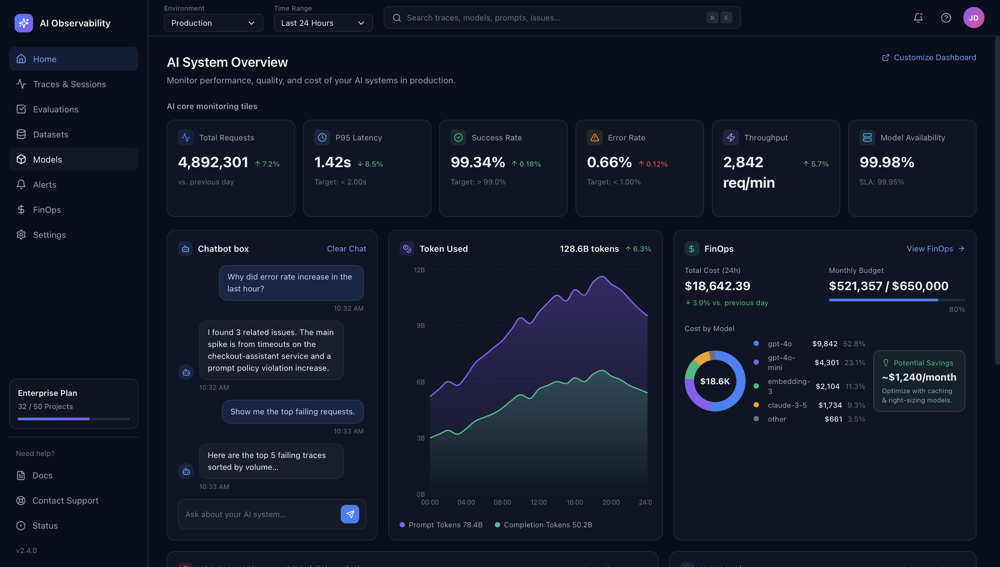

# AI Observability Dashboard

A React dashboard that visualizes performance, quality, and cost metrics for AI systems running in production. Built as a pixel-inspired reproduction of a modern LLM observability UI — dark-themed, responsive, and component-driven.



> Replace `docs/preview.png` with your own screenshot after running the app locally.

---

## Highlights

- **AI System Overview** — six top-level KPI tiles: Total Requests, P95 Latency, Success Rate, Error Rate, Throughput, Model Availability.
- **Chatbot panel** — an interactive-looking assistant for querying system state ("Why did error rate increase in the last hour?").
- **Token Usage chart** — stacked area chart splitting prompt vs. completion token consumption over time.
- **FinOps panel** — 24h spend, monthly budget progress, cost-by-model donut, and a potential-savings callout.
- **Top 10 prod issues** — severity-ranked issue feed with impact and last-seen timestamps.
- **LLM Metrics** — sparklines for Latency (P50/P95), Hallucination Rate, Prompt Success, Tokens per Request.

---

## Tech Stack

| Area          | Choice                                                |
| ------------- | ----------------------------------------------------- |
| Framework     | [React 18](https://react.dev)                         |
| Build tool    | [Vite 5](https://vitejs.dev)                          |
| Charts        | [Recharts](https://recharts.org) + inline SVG (donut) |
| Icons         | [lucide-react](https://lucide.dev)                    |
| Styling       | Plain CSS with CSS custom properties (no framework)   |

No Tailwind, no UI kit, no global state — it's intentionally small and easy to read.

---

## Project Structure

```
ai-observability/
├── index.html                 # Vite entry HTML
├── package.json               # Dependencies + scripts
├── vite.config.js             # Vite config (port 5173)
├── src/
│   ├── main.jsx               # React root
│   ├── App.jsx                # Page layout (sidebar + main)
│   ├── index.css              # Theme tokens + all component styles
│   └── components/
│       ├── Sidebar.jsx        # Left nav, Enterprise Plan box, footer
│       ├── TopBar.jsx         # Env / time range / search / profile
│       ├── MetricTiles.jsx    # Six KPI tiles
│       ├── Chatbot.jsx        # Conversational panel
│       ├── TokenChart.jsx     # Prompt vs. completion area chart
│       ├── FinOps.jsx         # Budget, donut chart, savings card
│       ├── IssuesTable.jsx    # Top 10 prod issues table
│       └── LLMMetrics.jsx     # Four sparkline KPIs
└── README.md
```

All layout lives in `App.jsx`, the theme lives in `index.css`, and every panel is a single self-contained component.

---

## Getting Started

### Prerequisites

- Node.js 18 or newer
- npm (bundled with Node) — or use `pnpm` / `yarn` / `bun` equivalents

### Install & Run

```bash
# 1. Clone
git clone https://github.com/venkykals/ai-observability.git
cd ai-observability

# 2. Install dependencies
npm install

# 3. Start the dev server
npm run dev
```

Then open http://localhost:5173 in your browser.

### Build for Production

```bash
npm run build     # output goes to dist/
npm run preview   # serve the built bundle locally
```

---

## Customizing the Dashboard

All data shown is **mocked** inside each component file — swap any array for your API response and it will render.

| To change…               | Edit…                                       |
| ------------------------ | ------------------------------------------- |
| KPI tile values          | `src/components/MetricTiles.jsx` (`tiles`)  |
| Token-usage series       | `src/components/TokenChart.jsx` (`data`)    |
| Cost breakdown / donut   | `src/components/FinOps.jsx` (`costs`)       |
| Issues feed              | `src/components/IssuesTable.jsx` (`issues`) |
| Sparkline KPIs           | `src/components/LLMMetrics.jsx` (`metrics`) |
| Color palette / spacing  | `:root` tokens in `src/index.css`           |

### Theme Tokens

The dark theme is driven by CSS variables at the top of `src/index.css`:

```css
:root {
  --bg:            #0a0f1c;
  --card:          #0f1524;
  --card-border:   #1f2a3d;
  --text-primary:  #f3f4f6;
  --text-secondary:#9ca3af;
  --accent-blue:   #3b82f6;
  --accent-green:  #10b981;
  --accent-red:    #ef4444;
  --accent-yellow: #f59e0b;
  --accent-purple: #8b5cf6;
  --accent-cyan:   #06b6d4;
}
```

Swap these to rebrand the whole dashboard in one place.

---

## Responsiveness

The layout uses a 6-column tile grid and a 3/2-column content grid on wide screens, collapsing to stacked panels below 1400px (see the media query at the bottom of `index.css`). Tweak that breakpoint to taste.

---

